# Conectar Doações 
[](https://github.com/diegosneves/conectar-doacoes/actions/workflows/ci-prod.yaml)
[](https://sonarcloud.io/summary/new_code?id=conectar-doacoes)
[](https://sonarcloud.io/summary/new_code?id=conectar-doacoes)
[](https://sonarcloud.io/summary/new_code?id=conectar-doacoes)

---

O `Conectar Doações` é uma plataforma de conexão de doadores e organizações/receptores de doações. Buscamos junto à
tecnologia ajudar a fazer a diferença na vida das pessoas, tornando mais fácil a prática de doações a quem precisa. 

# Conteúdo
- [Recursos](#Recursos)
- [Arquitetura Hexagonal](#Arquitetura-Hexagonal)
- [Swagger](#Swagger)
- [Docker](#Docker)
  - [Como rodar o projeto com Docker](#como-rodar-o-projeto-com-docker)
  - [Como parar](#como-parar)
- [UML](#UML)
  - [CORE](#core)

## Recursos

- **Visualização de locais que precisam de doações**: Permitimos que os doadores vejam exatamente quais organizações e locais estão necessitando de doações em tempo real.

- **Informações detalhadas sobre necessidades**: As organizações podem detalhar quais tipos de doações são necessárias, permitindo aos doadores direcionarem suas doações de maneira mais efetiva.

- **Facilitação do processo de doação**: Nossa plataforma se propõem a tornar a doação uma atividade fácil e simples de ser realizada, incentivando cada vez mais pessoas a participarem.

---

## Arquitetura Hexagonal
Este projeto segue a arquitetura hexagonal, que é uma forma de organização de código que tem como objetivo tornar a base de código mais manutenível e desacoplada. Nesse modelo, a lógica de negócios central (domínio) é isolada das preocupações externas através do uso de portas e adaptadores (daí o nome "hexagonal").


---

## Swagger
- [API Conectar Doações - Swagger](http://localhost:8080/swagger-ui/index.html)

---

## Docker

Este projeto utiliza Docker para garantir que a aplicação seja construída e executada no mesmo ambiente, independentemente do local. Para construir e rodar a imagem Docker, siga os passos:

### Como rodar o projeto com Docker

1. Crie um arquivo chamado `docker-compose.yaml`. Este arquivo irá definir o ambiente necessário para rodar o projeto utilizando Docker.
```yaml
services:
  database:
    image: "mysql:latest"
    container_name: conectar_doacoes_mysql_db
    environment:
      - MYSQL_DATABASE=${DB_NAME}
      - MYSQL_ROOT_PASSWORD=${DB_PASSWORD}
    ports:
      - "3307:3306"
    volumes:
      - db-mysql-conectar-doacoes:/var/lib/mysql

  conectar-doacoes-app:
    image: diegoneves/conectar-doacoes:latest
    container_name: conectar_doacoes_api
    ports:
      - "8080:8080"
      - "8081:5005"
    depends_on:
      - database
    environment:
      - DB_HOST=database
      - DB_PORT=3306
    entrypoint: sh -c "dockerize -wait tcp://$${DB_HOST}:$${DB_PORT} -timeout 20s && java -agentlib:jdwp=transport=dt_socket,server=y,suspend=n,address=*:5005 -jar target/conectar-doacoes.jar"

volumes:
  db-mysql-conectar-doacoes:

```
2. Rode o comando `docker-compose up -d`. Este comando irá iniciar todos os serviços definidos no arquivo `docker-compose.yaml` em segundo plano.

### Como parar

Para parar todos os serviços que estão sendo executados com o Docker Compose, é necessário apenas rodar o comando `docker-compose down`. Esse comando irá parar e remover todos os contêineres, redes e volumes definidos pelo `docker-compose.yaml`.

> **Nota**: Substitua `<docker-compose.yaml>` pelo conteúdo adequado do seu arquivo `docker-compose.yaml`. 

---

## UML


### CORE:

```mermaid
classDiagram
direction BT
class Address {
  + Address(String, String, String, String, String, String, String) 
  + String NEIGHBORHOOD_NAME_ERROR_MESSAGE
  - String street
  - String id
  - String neighborhood
  - String city
  + String RESIDENCE_NUMBER_ERROR_MESSAGE
  + String STREET_NAME_ERROR_MESSAGE
  + String CITY_NAME_ERROR_MESSAGE
  + String INVALID_ID_MESSAGE
  - String number
  + String STATE_NAME_ERROR_MESSAGE
  + String CEP_ERROR_MESSAGE
  - String state
  - String zip
  + getId() String
  + getStreet() String
  + getNumber() String
  + getNeighborhood() String
  + getCity() String
  + getState() String
  + getZip() String
  - validateData() void
  - validateData(String, String) void
}
class AddressCreationFailureException {
  + AddressCreationFailureException(String, Throwable) 
  + AddressCreationFailureException(String) 
  + ExceptionDetails ERROR
}
class AddressFactory {
  - AddressFactory() 
  + create(String, String, String, String, String, String) Address
}
class Donation {
  + Donation(String, String, Integer) 
  - String id
  + String INVALID_DESCRIPTION_ERROR
  - Integer amount
  + int DEFAULT_DONATION_AMOUNT
  + String INVALID_ID_MESSAGE
  - String description
  + String INVALID_QUANTITY
  + getId() String
  + getDescription() String
  + getAmount() Integer
  - defaultAmount(Integer) Integer
  - validateData() void
}
class DonationFactory {
  - DonationFactory() 
  + created(String, Integer) Donation
}
class DonationRegisterFailureException {
  + DonationRegisterFailureException(String) 
  + DonationRegisterFailureException(String, Throwable) 
  + ExceptionDetails ERROR
}
class ExceptionDetails {
<<enumeration>>
  - ExceptionDetails(String) 
  +  DONATION_CREATION_ERROR
  +  INVALID_UUID_FORMAT_MESSAGE
  +  SHELTER_MANIPULATION_ERROR
  - String message
  +  USER_CREATION_ERROR
  +  ADDRESS_CREATION_ERROR
  +  SHELTER_CREATION_ERROR
  +  USER_MANIPULATION_ERROR
  +  EXCEPTION_TYPE_NOT_THROWN
  + buildMessage(String) String
}
class RepositoryContract~T~ {
<<Interface>>
  + findEntityById(String) T
  + retrieveAll() List~T~
  + persist(T) T
  + deleteEntityById(String) void
}
class Shelter {
  + Shelter(String, String, Address, UserContract) 
  - String id
  - Address address
  + String DONATION_REQUIRED_ERROR
  + String ADDRESS_REQUIRED_ERROR
  - UserContract responsibleUser
  + String ID_VALIDATION_FAILURE
  + String SHELTER_NAME_REQUIRED_ERROR
  - List~Donation~ donations
  - String shelterName
  + String RESPONSIBLE_REQUIRED_ERROR
  + getUser() UserContract
  + addDonation(Donation) void
  + getAddress() Address
  + changeShelterName(String) void
  + getDonations() List~Donation~
  + getId() String
  + getShelterName() String
  + changeAddress(Address) void
  - validateData() void
}
class ShelterContract {
<<Interface>>
  + addDonation(Donation) void
  + getShelterName() String
  + getDonations() List~Donation~
  + getId() String
  + getUser() UserContract
  + getAddress() Address
  + changeAddress(Address) void
  + changeShelterName(String) void
}
class ShelterContractRepository {
<<Interface>>

}
class ShelterCreationFailureException {
  + ShelterCreationFailureException(String) 
  + ShelterCreationFailureException(String, Throwable) 
  + ExceptionDetails ERROR
}
class ShelterFactory {
  - ShelterFactory() 
  + create(String, Address, UserContract) Shelter
}
class ShelterService {
  + ShelterService(ShelterContractRepository) 
  + String INVALID_SHELTER_ID_MESSAGE
  + String DONATION_REQUIRED_ERROR_MESSAGE
  + String ERROR_MESSAGE_ADDRESS_NULL
  - ShelterContractRepository shelterContractRepository
  + String INVALID_SHELTER_NAME_ERROR_MESSAGE
  + changeAddress(String, Address) void
  + createShelter(String, Address, UserContract) ShelterContract
  + getShelter(String) ShelterContract
  - validateShelterId(String) void
  + addDonation(String, Donation) void
  + getDonations(String) List~Donation~
  + changeShelterName(String, String) void
}
class ShelterServiceContract {
<<Interface>>
  + changeShelterName(String, String) void
  + changeAddress(String, Address) void
  + addDonation(String, Donation) void
  + getShelter(String) ShelterContract
  + getDonations(String) List~Donation~
  + createShelter(String, Address, UserContract) ShelterContract
}
class ShelterServiceFailureException {
  + ShelterServiceFailureException(String, Throwable) 
  + ShelterServiceFailureException(String) 
  + ExceptionDetails ERROR
}
class User {
  + User(String, String, String, UserProfile, String) 
  + String PASSWORD_NOT_PROVIDED
  + String USERNAME_REQUIRED
  + String PROFILE_NOT_PROVIDED
  - String email
  - UserProfile userProfile
  + String EMAIL_NOT_PROVIDED
  - String userPassword
  - String id
  - String userName
  + String USER_ID_REQUIRED
  + changeUserPassword(String) void
  + getUserProfile() UserProfile
  + getUsername() String
  - validateData() void
  + changeUserName(String) void
  + getUserPassword() String
  + getId() String
  + getEmail() String
}
class UserContract {
<<Interface>>
  + getUsername() String
  + getEmail() String
  + getUserProfile() UserProfile
  + getUserPassword() String
  + changeUserPassword(String) void
  + changeUserName(String) void
  + getId() String
}
class UserContractRepository {
<<Interface>>

}
class UserCreationFailureException {
  + UserCreationFailureException(String) 
  + UserCreationFailureException(String, Throwable) 
  + ExceptionDetails ERROR
}
class UserFactory {
  - UserFactory() 
  + create(String, String, UserProfile, String) User
}
class UserProfile {
<<enumeration>>
  - UserProfile(String) 
  +  BENEFICIARY
  +  DONOR
  - String name
  + toString() String
}
class UserService {
  + UserService(UserContractRepository) 
  + String USERNAME_INVALID_ERROR_MESSAGE
  - UserContractRepository userContractRepository
  + String INVALID_IDENTIFIER_ERROR_MESSAGE
  + String INVALID_NEW_PASSWORD_MESSAGE
  + String USER_NOT_FOUND_MESSAGE
  + getUser(String) UserContract
  - validateUserId(String) void
  + createUser(String, String, UserProfile, String) UserContract
  + changePassword(String, String) void
  + changeUserName(String, String) void
}
class UserServiceContract {
<<Interface>>
  + changePassword(String, String) void
  + createUser(String, String, UserProfile, String) UserContract
  + getUser(String) UserContract
  + changeUserName(String, String) void
}
class UserServiceFailureException {
  + UserServiceFailureException(String, Throwable) 
  + UserServiceFailureException(String) 
  + ExceptionDetails ERROR
}
class UuidUtils {
  - UuidUtils() 
  - String EMPTY_UUID
  - Logger log
  - String NULL_UUID
  - String INVALID_UUID_ERROR
  + String UUID_REQUIRED
  + generateUuid() String
  + isValidUUID(String) boolean
}
class UuidUtilsException {
  + UuidUtilsException(String) 
  + ExceptionDetails ERROR
}
class ValidationUtils {
  - ValidationUtils() 
  + validateNotNullOrEmpty(T, String, Class~RuntimeException~) void
  - throwException(String, Class~RuntimeException~) void
}
class ValidationUtilsException {
  + ValidationUtilsException(String, Throwable) 
  + ExceptionDetails ERROR
}

Address  ..>  AddressCreationFailureException 
Address  ..>  Shelter 
Address  ..>  UuidUtils 
Address  ..>  UuidUtilsException 
AddressCreationFailureException "1" *--> "ERROR 1" ExceptionDetails 
AddressFactory  ..>  Address 
AddressFactory  ..>  AddressCreationFailureException 
AddressFactory  ..>  UuidUtils 
Donation  ..>  DonationRegisterFailureException 
Donation  ..>  UuidUtils 
Donation  ..>  UuidUtilsException 
Donation  ..>  ValidationUtils 
DonationFactory  ..>  Donation 
DonationFactory  ..>  DonationRegisterFailureException 
DonationFactory  ..>  UuidUtils 
DonationFactory  ..>  UuidUtilsException 
DonationRegisterFailureException "1" *--> "ERROR 1" ExceptionDetails 
Shelter "1" *--> "address 1" Address 
Shelter "1" *--> "donations *" Donation 
Shelter  ..>  ShelterContract 
Shelter  ..>  ShelterCreationFailureException 
Shelter "1" *--> "responsibleUser 1" UserContract 
Shelter  ..>  UuidUtils 
Shelter  ..>  UuidUtilsException 
Shelter  ..>  ValidationUtils 
ShelterContract  ..>  Address 
ShelterContract  ..>  Donation 
ShelterContract  ..>  Shelter 
ShelterContract  ..>  ShelterCreationFailureException 
ShelterContract  ..>  UserContract 
ShelterContractRepository  -->  RepositoryContract~T~ 
ShelterContractRepository  ..>  Shelter 
ShelterContractRepository  ..>  ShelterContract 
ShelterCreationFailureException "1" *--> "ERROR 1" ExceptionDetails 
ShelterFactory  ..>  Address 
ShelterFactory  ..>  Shelter 
ShelterFactory  ..>  ShelterCreationFailureException 
ShelterFactory  ..>  UserContract 
ShelterFactory  ..>  UuidUtils 
ShelterService  ..>  Address 
ShelterService  ..>  Donation 
ShelterService  ..>  RepositoryContract~T~ 
ShelterService  ..>  Shelter 
ShelterService  ..>  ShelterContract 
ShelterService "1" *--> "shelterContractRepository 1" ShelterContractRepository 
ShelterService  ..>  ShelterCreationFailureException 
ShelterService  ..>  ShelterFactory 
ShelterService  ..>  ShelterServiceContract 
ShelterService  ..>  ShelterServiceFailureException 
ShelterService  ..>  UserContract 
ShelterService  ..>  UuidUtils 
ShelterService  ..>  UuidUtilsException 
ShelterService  ..>  ValidationUtils 
ShelterServiceContract  ..>  Address 
ShelterServiceContract  ..>  Donation 
ShelterServiceContract  ..>  Shelter 
ShelterServiceContract  ..>  ShelterContract 
ShelterServiceContract  ..>  ShelterCreationFailureException 
ShelterServiceContract  ..>  ShelterServiceFailureException 
ShelterServiceContract  ..>  UserContract 
ShelterServiceFailureException "1" *--> "ERROR 1" ExceptionDetails 
User  ..>  UserContract 
User  ..>  UserCreationFailureException 
User "1" *--> "userProfile 1" UserProfile 
User  ..>  UuidUtils 
User  ..>  UuidUtilsException 
User  ..>  ValidationUtils 
UserContract  ..>  UserCreationFailureException 
UserContract  ..>  UserProfile 
UserContractRepository  -->  RepositoryContract~T~ 
UserContractRepository  ..>  UserContract 
UserCreationFailureException "1" *--> "ERROR 1" ExceptionDetails 
UserFactory  ..>  User 
UserFactory  ..>  UserCreationFailureException 
UserFactory  ..>  UserProfile 
UserFactory  ..>  UuidUtils 
UserService  ..>  RepositoryContract~T~ 
UserService  ..>  User 
UserService  ..>  UserContract 
UserService "1" *--> "userContractRepository 1" UserContractRepository 
UserService  ..>  UserCreationFailureException 
UserService  ..>  UserFactory 
UserService  ..>  UserProfile 
UserService  ..>  UserServiceContract 
UserService  ..>  UserServiceFailureException 
UserService  ..>  UuidUtils 
UserService  ..>  UuidUtilsException 
UserService  ..>  ValidationUtils 
UserServiceContract  ..>  UserContract 
UserServiceContract  ..>  UserCreationFailureException 
UserServiceContract  ..>  UserProfile 
UserServiceContract  ..>  UserServiceFailureException 
UserServiceFailureException "1" *--> "ERROR 1" ExceptionDetails 
UuidUtils  ..>  UuidUtilsException 
UuidUtilsException "1" *--> "ERROR 1" ExceptionDetails 
ValidationUtils  ..>  ValidationUtilsException 
ValidationUtilsException "1" *--> "ERROR 1" ExceptionDetails 

```


---